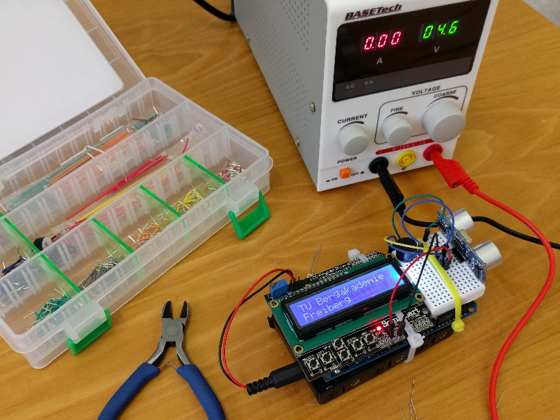
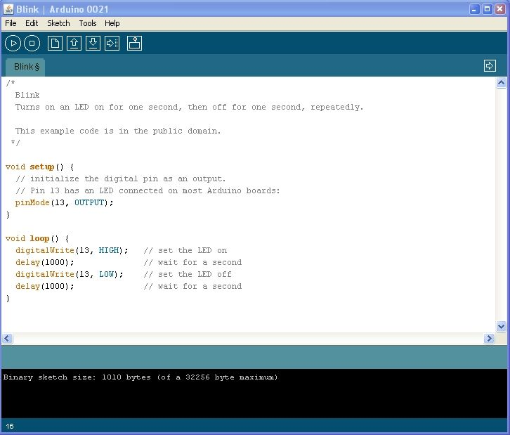
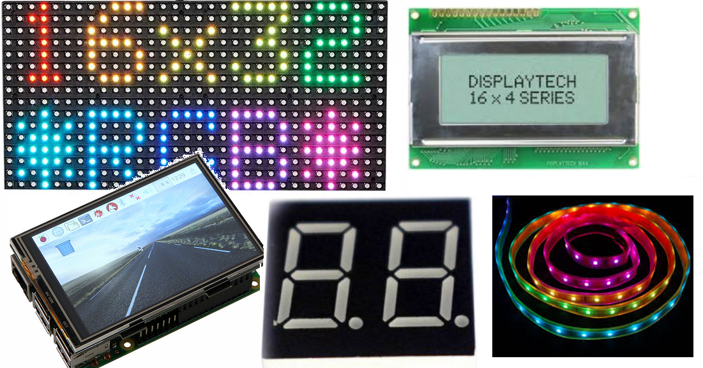
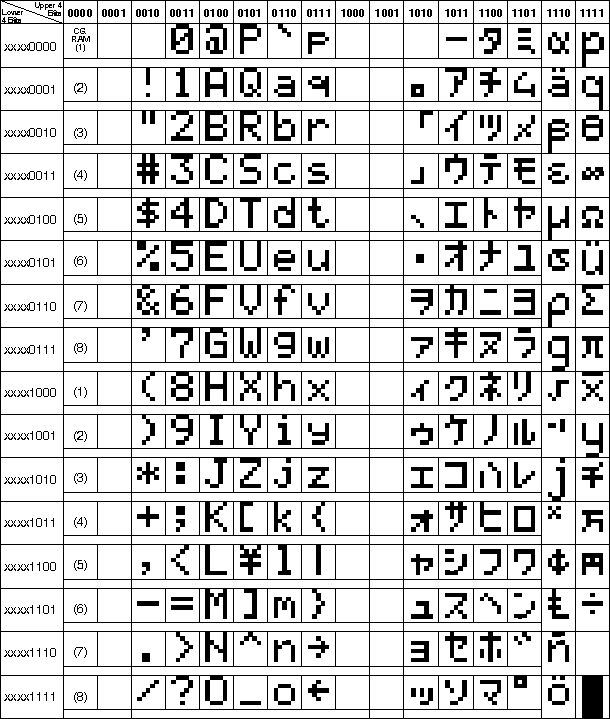

<!--

author:   Sebastian Zug & André Dietrich
email:    zug@ovgu.de   & andre.dietrich@ovgu.de
version:  0.0.1
language: de
narrator: Deutsch Female

script:   https://felixhao28.github.io/JSCPP/dist/JSCPP.es5.min.js

@JSCPP.__eval
<script>
  try {
    var output = "";
    JSCPP.run(`@0`, `@1`, {stdio: {write: s => { output += s }}});
    output;
  } catch (msg) {
    var error = new LiaError(msg, 1);

    try {
        var log = msg.match(/(.*)\nline (\d+) \(column (\d+)\):.*\n.*\n(.*)/);
        var info = log[1] + " " + log[4];

        if (info.length > 80)
          info = info.substring(0,76) + "..."

        error.add_detail(0, info, "error", log[2]-1, log[3]);
    } catch(e) {}

    throw error;
    }
</script>
@end


@JSCPP.eval: @JSCPP.__eval(@input, )

@JSCPP.eval_input: @JSCPP.__eval(@input,`@input(1)`)

@output: <pre class="lia-code-stdout">@0</pre>

@output_: <pre class="lia-code-stdout" hidden="true">@0</pre>


script:   https://ajax.googleapis.com/ajax/libs/jquery/1.11.3/jquery.min.js

@Rextester.__eval
<script>
//var result = null;
var error  = false;

console.log = function(e){ send.lia("log", JSON.stringify(e), [], true); };

function grep_(type, output) {
  try {
    let re_s = ":(\\d+):(\\d+): "+type+": (.+)";

    let re_g = new RegExp(re_s, "g");
    let re_i = new RegExp(re_s, "i");

    let rslt = output.match(re_g);

    let i = 0;
    for(i = 0; i < rslt.length; i++) {
        let e = rslt[i].match(re_i);

        rslt[i] = { row : e[1]-1, column : e[2], text : e[3], type : type};
    }
    return [rslt];
  } catch(e) {
    return [];
  }
}

$.ajax ({
    url: "https://rextester.com/rundotnet/api",
    type: "POST",
    timeout: 10000,
    data: { LanguageChoice: @0,
            Program: `@input`,
            Input: `@1`,
            CompilerArgs : @2}
    }).done(function(data) {
        if (data.Errors == null) {
            let warnings = grep_("warning", data.Warnings);

            let stats = "\n-------Stat-------\n"+data.Stats.replace(/, /g, "\n");

            if(data.Warnings)
              stats = "\n-------Warn-------\n"+data.Warnings + stats;

            send.lia("log", data.Result+stats, warnings, true);
            send.lia("eval", "LIA: stop");

        } else {
            let errors = grep_("error", data.Errors);

            let stats = "\n-------Stat-------\n"+data.Stats.replace(/, /g, "\n");

            if(data.Warning)
              stats = data.Errors + data.Warnings + stats;
            else
              stats = data.Errors + data.Warnings + stats;

            send.lia("log", stats, errors, false);
            send.lia("eval", "LIA: stop");
        }
    }).fail(function(data, err) {
        send.lia("log", err, [], false);
        send.lia("eval", "LIA: stop");
    });

"LIA: wait"
</script>
@end


@Rextester.eval: @Rextester.__eval(6, ,"-Wall -std=gnu99 -O2 -o a.out source_file.c")

@Rextester.eval_params: @Rextester.__eval(6, ,"@0")

@Rextester.eval_input: @Rextester.__eval(6,`@input(1)`,"-Wall -std=gnu99 -O2 -o a.out source_file.c")

-->

# MINT-Tag des Cotta-Gymnasiums Brand-Erbisdorf

**Einführung eingebettete Systeme**

Prof. Dr. Sebastian Zug, Prof. Dr. Bernhard Jung, Technische Universität Bergakademie Freiberg

------------------------------

<!-- width="80%" -->

Herzlich Willkommen!

> Die interaktive Ansicht dieses Kurses ist unter folgendem [Link](https://liascript.github.io/course/?https://raw.githubusercontent.com/liaScript/ArduinoEinstieg/master/Introduction.md#1) verfügbar.

## 0. Wie viel Informatik steckt in MINT?
{{0-1}}
<!-- width="60%" -->

{{0-1}}
> _"Ein Auto ist ein Computer\[netzwerk\] mit vier Rädern"_ (Quelle gesucht)


{{1-2}}
... und warum sollte ich das in Freiberg studieren?

{{1-2}}
<!-- width="80%" -->

{{1-2}}
Link zu den Webseiten des Institutes: https://tu-freiberg.de/fakult1/inf

## 1. Einführung

+ Was heißt das eigentlich "Eingebettetes System"?

{{1-2}}
> ... ein elektronischer Rechner ..., der in einen technischen Kontext
> eingebunden ist. Dabei übernimmt der (Kleinst-)Rechner entweder
> Überwachungs-, Steuerungs- oder Regelfunktionen ... weitestgehend unsichtbar
> für den Benutzer .. [^1].

+ Wie programmiere ich einen Mikrocontroller?

{{2-3}}
> Compiler wird eine Software genannt, die einen in einer Programmiersprache
> geschrieben Quellcode so übersetzt, dass sie von Maschinen verstanden
> werden können.

+ Was ist das Arduino Projekt?

{{3}}
> Arduino ist eine aus Soft- und Hardware bestehende
> Physical-Computing-Plattform. Beide Komponenten sind im Sinne von Open
> Source quelloffen. Die Hardware besteht aus einem einfachen E/A-Board mit
> einem Mikrocontroller und analogen und digitalen Ein- und Ausgängen.

{{3}}
  https://www.arduino.cc/

{{3}}
  <!-- width="70%" -->
  [^3]

{{3}}
[^1] nach Wikipedia "Eingebettete Systeme"
[^2] http://21stdigitalhome.blogspot.com/2016/03/cross-compiling-compile-c-programs-on.html
[^3] aus entsprechendem Artikel "Spiegel Online" http://www.spiegel.de/netzwelt/gadgets/arduino-erklaert-das-kann-der-microcontroller-a-1105328.html


## 2. Arduino Hardware / Software

{{0}}
**2.1 Die Hardware**

{{0}}
<!-- width="80%" -->


{{1}}
**2.2 Aufbau eines Arduino-Programmes**

{{1}}
Arduino nutzt eine C/C++ Semantik für die Programmierung, die folgende
Grundelemente bedient

{{1}}
```c     A_BlinkLed.c
// the setup function runs once when you press reset or power the board
const int ledPin = A2;

void setup() {
  pinMode(ledPin, OUTPUT);
}

void loop() {
  digitalWrite(ledPin, HIGH);  // turn the LED on (HIGH is the voltage level)
  delay(1000);                 // wait for a second
  digitalWrite(ledPin, LOW);   // turn the LED off by making the voltage LOW
  delay(1000);                 // wait for a second
}
```

{{2}}
**2.2 Arduino IDE**

{{2}}
<!-- width="80%" -->

{{3}}
**2.3 ... und jetzt mal praktisch**

## 3. Unser Projekt

"Entwickeln Sie einen Distanzmesser, der einen Abstandswert ermittelt und ausgibt"

<!-- width="80%" -->
[^1]

[^1] Firma Bosch "Laser Distanzmesser Zamo"


{{1}}
Was brauchen wir dafür?

### Distanzmessung mit Ultraschall

... Was war das noch mal, "Schallgeschwindigkeit"

<!-- width="40%" -->
[^1]

[^1] roboticlab.eu "Funktionsweise eines Ultraschall-Entfernungsmessers."

{{1}}
```c     B_UltraSonic.c
#include <NewPing.h>

#define TRIGGER_PIN  16  // Arduino pin tied to trigger pin on the ultrasonic sensor.
#define ECHO_PIN     15  // Arduino pin tied to echo pin on the ultrasonic sensor.
#define MAX_DISTANCE 30  // Maximum distance we want to ping for (in centimeters).

NewPing sonar(TRIGGER_PIN, ECHO_PIN, MAX_DISTANCE);
// NewPing setup of pins and maximum distance.

void setup() {
  Serial.begin(9600);
}

void loop() {
  delay(50);                     // Wait 50ms between pings (about 20 pings/sec).
  Serial.print("Ping: ");
  Serial.print(sonar.ping_cm()); // Send ping, get distance in cm and print result
  Serial.println("cm");          //(0 = outside set distance range)
}
```
{{1}}
Ausblick: Arduino Plot, Schalten der LED, Eingangszähler

### Display

{{0-1}}
Welches Display zu welchem Zweck?

{{0-1}}
<!-- width="80%" -->

{{1-2}}
<!-- width="60%" -->

{{1-2}}
<!-- width="60%" -->

{{2}}
<!--
style="width: 80%; max-width: 460px; display: block; margin-left: auto; margin-right: auto;"
-->
````
    0                             15
    0 1 2 3 4 5 6 7 8 9 A B C D E F
   ╔═╤═╤═╤═╤═╤═╤═╤═╤═╤═╤═╤═╤═╤═╤═╤═╗
 0 ║h│e│l│l│o│ │w│o│r│l│d│ │ │ │ │ ║
   ╟─┼─┼─┼─┼─┼─┼─┼─┼─┼─┼─┼─┼─┼─┼─┼─╢
 1 ║5│1│7│1│ │ │ │ │ │ │ │ │ │ │ │ ║
   ╚═╧═╧═╧═╧═╧═╧═╧═╧═╧═╧═╧═╧═╧═╧═╧═╝
````

{{2}}
```c     C_Display.c
#include <LiquidCrystal.h>

LiquidCrystal lcd(8, 9, 4, 5, 6, 7);

void setup()
{
  lcd.begin(16, 2);
  lcd.clear();
  lcd.setCursor(0, 0);
  lcd.print("hello world");
  lcd.setCursor(1, 0);
  lcd.print("5171");
}

void loop()
{
}
```

{{1}}
Ausblick: `scrollDisplayLeft()` [Arduino Dokumentation](https://www.arduino.cc/en/Reference/LiquidCrystalScrollDisplayLeft)

### Und nun alles zusammen ...

Welche Funktionen brauchen wir also?

<!--
style="width: 60%; max-width: 300px; display: block; margin-left: auto; margin-right: auto;"
-->
````
            .------------------------.
            |                        |
            v                        |
 ╔══════════════════════╗            |
 ║ Distanz einlesen     ║  n mal     |
 ╚══════════════════════╝            |
            |                        |
            v                        |
 ╔══════════════════════╗            |
 ║ Mittelwert berechnen ║            |
 ╚══════════════════════╝            |
            |                        |
            v                        |
 ╔══════════════════════╗            |
 ║ Ausgabe Display      ║            |
 ╚══════════════════════╝            |
            |                        |
            '------------------------╯
````

{{1}}
```c     D_Final.c
#include <LiquidCrystal.h>

LiquidCrystal lcd(8, 9, 4, 5, 6, 7);
// ToDo Ultraschallsensor integrieren

float result = 0;

void showMeanDistance(){
  lcd.setCursor(0, 0);
  lcd.print("Distanz");
  lcd.setCursor(9, 0);
  lcd.print(result);
}

void readMeanDistance(){
  // Todo Messungen und Mittelwertgenerierung integrieren
  result = 32.1;
}

void setup()
{
  lcd.begin(16, 2);
}

void loop()
{
  readMeanDistance();
  showMeanDistance();
  delay(50);
}
```

## 4. Wie geht es weiter?

Unser Chef hat sich neue Ideen ausgedacht ...

1. Die Auflösung ist ihm zu gering!
2. Bestimmte Materialien werden nur schlecht erkannt.
3. Das Display wäre schlecht ablesbar und wir sollten unser Messsystem mit dem Mobiltelefon koppeln ...

{{1}}
*Danke für die Aufmerksamkeit*
