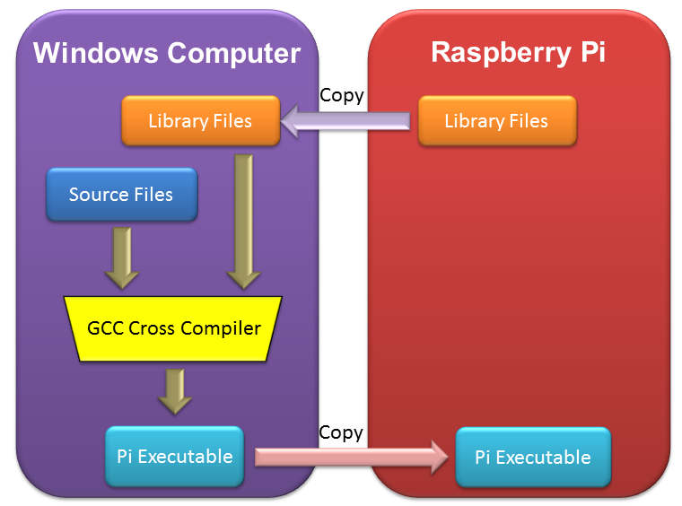
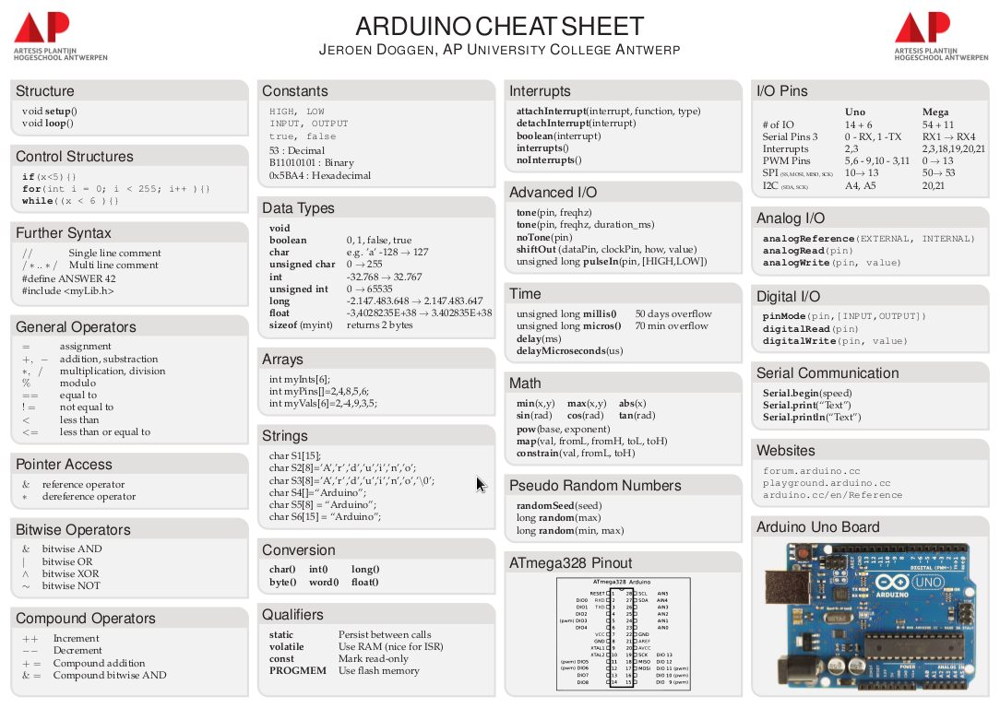
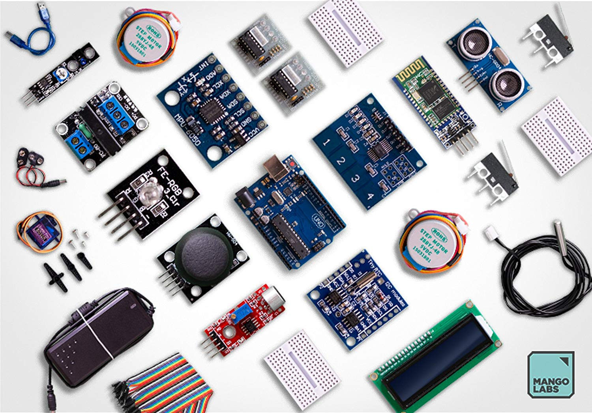

<!--

author:   Sebastian Zug & André Dietrich
email:    zug@ovgu.de   & andre.dietrich@ovgu.de
version:  0.0.1
language: de
narrator: Deutsch Female

script:   https://felixhao28.github.io/JSCPP/dist/JSCPP.es5.min.js

@JSCPP.__eval
<script>
  try {
    var output = "";
    JSCPP.run(`@0`, `@1`, {stdio: {write: s => { output += s }}});
    output;
  } catch (msg) {
    var error = new LiaError(msg, 1);

    try {
        var log = msg.match(/(.*)\nline (\d+) \(column (\d+)\):.*\n.*\n(.*)/);
        var info = log[1] + " " + log[4];

        if (info.length > 80)
          info = info.substring(0,76) + "..."

        error.add_detail(0, info, "error", log[2]-1, log[3]);
    } catch(e) {}

    throw error;
    }
</script>
@end


@JSCPP.eval: @JSCPP.__eval(@input, )

@JSCPP.eval_input: @JSCPP.__eval(@input,`@input(1)`)

@output: <pre class="lia-code-stdout">@0</pre>

@output_: <pre class="lia-code-stdout" hidden="true">@0</pre>


script:   https://ajax.googleapis.com/ajax/libs/jquery/1.11.3/jquery.min.js

@Rextester.__eval
<script>
//var result = null;
var error  = false;

console.log = function(e){ send.lia("log", JSON.stringify(e), [], true); };

function grep_(type, output) {
  try {
    let re_s = ":(\\d+):(\\d+): "+type+": (.+)";

    let re_g = new RegExp(re_s, "g");
    let re_i = new RegExp(re_s, "i");

    let rslt = output.match(re_g);

    let i = 0;
    for(i = 0; i < rslt.length; i++) {
        let e = rslt[i].match(re_i);

        rslt[i] = { row : e[1]-1, column : e[2], text : e[3], type : type};
    }
    return [rslt];
  } catch(e) {
    return [];
  }
}

$.ajax ({
    url: "https://rextester.com/rundotnet/api",
    type: "POST",
    timeout: 10000,
    data: { LanguageChoice: @0,
            Program: `@input`,
            Input: `@1`,
            CompilerArgs : @2}
    }).done(function(data) {
        if (data.Errors == null) {
            let warnings = grep_("warning", data.Warnings);

            let stats = "\n-------Stat-------\n"+data.Stats.replace(/, /g, "\n");

            if(data.Warnings)
              stats = "\n-------Warn-------\n"+data.Warnings + stats;

            send.lia("log", data.Result+stats, warnings, true);
            send.lia("eval", "LIA: stop");

        } else {
            let errors = grep_("error", data.Errors);

            let stats = "\n-------Stat-------\n"+data.Stats.replace(/, /g, "\n");

            if(data.Warning)
              stats = data.Errors + data.Warnings + stats;
            else
              stats = data.Errors + data.Warnings + stats;

            send.lia("log", stats, errors, false);
            send.lia("eval", "LIA: stop");
        }
    }).fail(function(data, err) {
        send.lia("log", err, [], false);
        send.lia("eval", "LIA: stop");
    });

"LIA: wait"
</script>
@end


@Rextester.eval: @Rextester.__eval(6, ,"-Wall -std=gnu99 -O2 -o a.out source_file.c")

@Rextester.eval_params: @Rextester.__eval(6, ,"@0")

@Rextester.eval_input: @Rextester.__eval(6,`@input(1)`,"-Wall -std=gnu99 -O2 -o a.out source_file.c")

-->

# Coding-Night 2018

**Evangelisches Gymnasium Doberlug-Kirchhain, 7. Dezember 2018**

Sebastian Zug, Technische Universität Bergakademie Freiberg

------------------------------

<!-- width="80%" -->


Herzlich Willkommen!

## 1. Einführung

+ Was heißt das eigentlich "Eingebettetes System"

  > ... ein elektronischer Rechner ..., der in einen technischen Kontext
  > eingebunden ist. Dabei übernimmt der (Kleinst-)Rechner entweder
  > Überwachungs-, Steuerungs- oder Regelfunktionen ... weitestgehend unsichtbar
  > für den Benutzer .. [^1].

  Beispiele: Kaffeemaschine, Türöffner, autonomes Auto

+ Programmiervorgang für Mikrocontroller

  > Compiler wird eine Software genannt, die einen in einer Programmiersprache
  > geschrieben Quellcode so übersetzt, dass sie von Maschinen verstanden
  > werden können.

  <!-- width="80%" --> [^2]


+ Arduino Idee

  > Arduino ist eine aus Soft- und Hardware bestehende
  > Physical-Computing-Plattform. Beide Komponenten sind im Sinne von Open
  > Source quelloffen. Die Hardware besteht aus einem einfachen E/A-Board mit
  > einem Mikrocontroller und analogen und digitalen Ein- und Ausgängen.

  https://www.arduino.cc/


[^1] nach Wikipedia "Eingebettete Systeme"
[^2] http://21stdigitalhome.blogspot.com/2016/03/cross-compiling-compile-c-programs-on.html

## 2. Arduino Hardware / Software

{{0-1}}
**2.1 Arduino Hardware**

{{0-1}}
<!-- width="70%" -->
[^1]

{{1}}
**2.2 Aufbau eines Arduino-Programmes**

Arduino nutzt eine C/C++ Semantik für die Programmierung, die folgende
Grundelemente bedient

+ Alle Anweisungen enden mit einem `;`
+ Variabeln sind typbehaftet (`int`, `char`, `float`, etc.)
+ wichtige Schlüsselwörter sind `for`, `if`, `while`, etc.
+ Kommentare werden durch `//` eingeleitet

<!-- width="80%" -->

{{1}}
```c
// the setup function runs once when you press reset or power the board
void setup() {
  // initialize digital pin LED_BUILTIN as an output.
  pinMode(LED_BUILTIN, OUTPUT);
}

// the loop function runs over and over again forever
void loop() {
  digitalWrite(LED_BUILTIN, HIGH);   // turn the LED on (HIGH is the voltage level)
  delay(1000);                       // wait for a second
  digitalWrite(LED_BUILTIN, LOW);    // turn the LED off by making the voltage LOW
  delay(1000);                       // wait for a second
}
```

{{2}}
**2.3 Arduino IDE**

{{2}}
<!-- width="80%" -->

[^1] aus entsprechendem Artikel "Spiegel Online" http://www.spiegel.de/netzwelt/gadgets/arduino-erklaert-das-kann-der-microcontroller-a-1105328.html

## 3. Aufgabenkomplexe

<!-- width="80%" -->

* Webseiten des Wiki des Herstellers mangolabs
   [https://www.mangolabs.de/wiki/](https://www.mangolabs.de/wiki/)

* Referenzübersicht Arduino

    + deutsch (unvollständig) https://www.arduino.cc/reference/de/

    + englisch https://www.arduino.cc/reference/en/


### 3a. Serielle Schnittstelle

-> Hello World Programm (Serielle Schnittstelle und LED anschalten)

{{1}}
> **Aufgabe:** Schreiben Sie einen Code, der die Zahlen von 0 bis 9 über die
> serielle Schnittstelle ausgibt.

{{2}}
```c
// Loesung
void setup() {
  Serial.begin(57600);
  for (int counter=0; counter < 10; counter++) {
    Serial.print(counter);
  }
}

void loop() {
}
```

{{2}}
-> Vorführung Erfassen von Zeichen

{{3}}
> **Aufgabe:** Erweitern Sie den Code, so dass wir die LED über 'A' an- und
> 'B' ausschalten können.

{{4}}
```c
// Loesung
void loop() {
  if (Serial.available() > 0) {
        incomingByte = Serial.read();
        Serial.write(incomingByte);
        if (incomingByte == 'A'){
          Serial.println("An");
          digitalWrite(13, HIGH);
        }
        if (incomingByte == 'B'){
          digitalWrite(13, LOW);
          Serial.println("Aus");
        }
  }
}
```

### 3b. Taster als Erweiterung

*Langweilig ... ! Das ist doch kein echtes eingebettetes System!*

> **Aufgabe:** Der Taster schaltet die LED ein und nach 3 Sekunden geht sie von
> selbst wieder aus.

Es wird ernst! Wir müssen den Taster elektrisch mit dem Board verbinden. Anweisungen unter ... [https://www.mangolabs.de/portfolio-item/micro-switches/](https://www.mangolabs.de/portfolio-item/micro-switches/)

{{1}}
```c
// Loesung
void loop() {
  // read the state of the pushbutton value:
  buttonState = digitalRead(buttonPin);

  // check if the pushbutton is pressed. If it is, the buttonState is HIGH:
  if (buttonState == HIGH) {
    // turn LED on:
    digitalWrite(ledPin, HIGH);
    delay(3000);
    digitalWrite(ledPin, LOW);
  }
}
```

> **Spezialaufgabe:** Nutzen Sie das kapazitive Tastenfeld für diese Aufgabe

### 3c. Distanzsensor als Input

*Langweilig ... ! Wir wollen einen echten Sensor!*

> **Aufgabe:** Schalten Sie die LED mittels Ultraschallsensor an und aus
> (distanzabhäniger Lichtschalter)

ACHTUNG: Sie müssen für die Integration des Sensors noch die Bibliothek
`NewPing` installieren. Finden Sie dafür allein einen Weg? Recherchieren sie in
den Arduino Foren zur Frage "How to install a library for Arduino?"

{{1}}
```c
// Loesung
#include <NewPing.h>

#define TRIGGER_PIN  12  // Arduino pin tied to trigger pin on the ultrasonic sensor.
#define ECHO_PIN     11  // Arduino pin tied to echo pin on the ultrasonic sensor.
#define MAX_DISTANCE 400 // Maximum distance we want to ping for (in centimeters).

const int ledPin =  13;      // the number of the LED pin

NewPing sonar(TRIGGER_PIN, ECHO_PIN, MAX_DISTANCE);
// NewPing setup of pins and maximum distance.

void setup() {
  Serial.begin(9600); // Open serial monitor at 9600 baud to see ping results.
  pinMode(ledPin, OUTPUT);
}

void loop() {
  delay(50);                     // Wait 50ms between pings (about 20 pings/sec).
  if ((sonar.ping_cm() < 10) && (sonar.ping_cm() > 0)){
     digitalWrite(ledPin, HIGH);
     Serial.println("Alarm!");
  }
  else
     digitalWrite(ledPin, LOW);
}
```

> **Spezialaufgabe:** Realisiert eine Aktivieren über eine Schallamplitude
> mittels Mikrophon.

### 3d. Es wird bunt

Integration der Mehrfarben LED als Erweiterung der Ausgabe
https://www.mangolabs.de/portfolio-item/rgb-led-2/

-> Vorführung Mehrfarben LED

```c
// Methoden aus dem Lösungsvorschlag der MangoLabs
const int redPin = 10;
const int greenPin = 9;
const int bluePin = 8;

void setColourRgb(unsigned int red, unsigned int green, unsigned int blue) {
  analogWrite(redPin, red);
  analogWrite(greenPin, green);
  analogWrite(bluePin, blue);
}

void setup() {
  // Start off with the LED off.
  setColourRgb(0,0,0);
}

void loop() {
  unsigned int rgbColour[3];

  // Start off with red.
  rgbColour[0] = 255;
  rgbColour[1] = 255;
  rgbColour[2] = 255;

  setColourRgb(rgbColour[0], rgbColour[1], rgbColour[2]);
  delay(1000);
}
```

> **Aufgabe:** Wechseln Sie die Farben der LED in Abhängigkeit von der Entfernung

{{1}}
```c
#include <NewPing.h>

#define TRIGGER_PIN  12  // Arduino pin tied to trigger pin on the ultrasonic sensor.
#define ECHO_PIN     11  // Arduino pin tied to echo pin on the ultrasonic sensor.
#define MAX_DISTANCE 256 // Maximum distance we want to ping for (in centimeters).

const int redPin = 10;
const int greenPin = 9;
const int bluePin = 8;

void setColourRgb(unsigned int red, unsigned int green, unsigned int blue) {
  analogWrite(redPin, red);
  analogWrite(greenPin, green);
  analogWrite(bluePin, blue);
}

const int ledPin =  13;      // the number of the LED pin

NewPing sonar(TRIGGER_PIN, ECHO_PIN, MAX_DISTANCE);
// NewPing setup of pins and maximum distance.

void setup() {
  Serial.begin(9600); // Open serial monitor at 9600 baud to see ping results.
  setColourRgb(0,0,0);
}

void loop() {
  int red, green, blue;
  delay(50);                     // Wait 50ms between pings (about 20 pings/sec).
  if ((sonar.ping_cm() <= 10) && (sonar.ping_cm() > 0)){
     Serial.println("Alarm!");
     setColourRgb(255, 0, 0);
  }
  if ((sonar.ping_cm() <= 20) && (sonar.ping_cm() > 10)){
     digitalWrite(ledPin, HIGH);
     Serial.println("Nah dran!");
     setColourRgb(0, 0, 255);
  }
  if ((sonar.ping_cm() <= 30) && (sonar.ping_cm() > 20)){
     digitalWrite(ledPin, HIGH);
     Serial.println("Nah dran!");
     setColourRgb(0, 255, 0);
  }
}
```

### 3e. Servomotor als Ausgabe

*Immer noch langweilig ... ! Wir wollen einen echten Aktor!*

> **Aufgabe:** Geben Sie die Ausgaben des Distanzsensors mit dem Servomotor aus.
> Entwerfen Sie dazu eine Skale die von "super weit weg" bis "dichter gehts nicht mehr".
> reicht.
https://www.mangolabs.de/portfolio-item/micro-servo/
